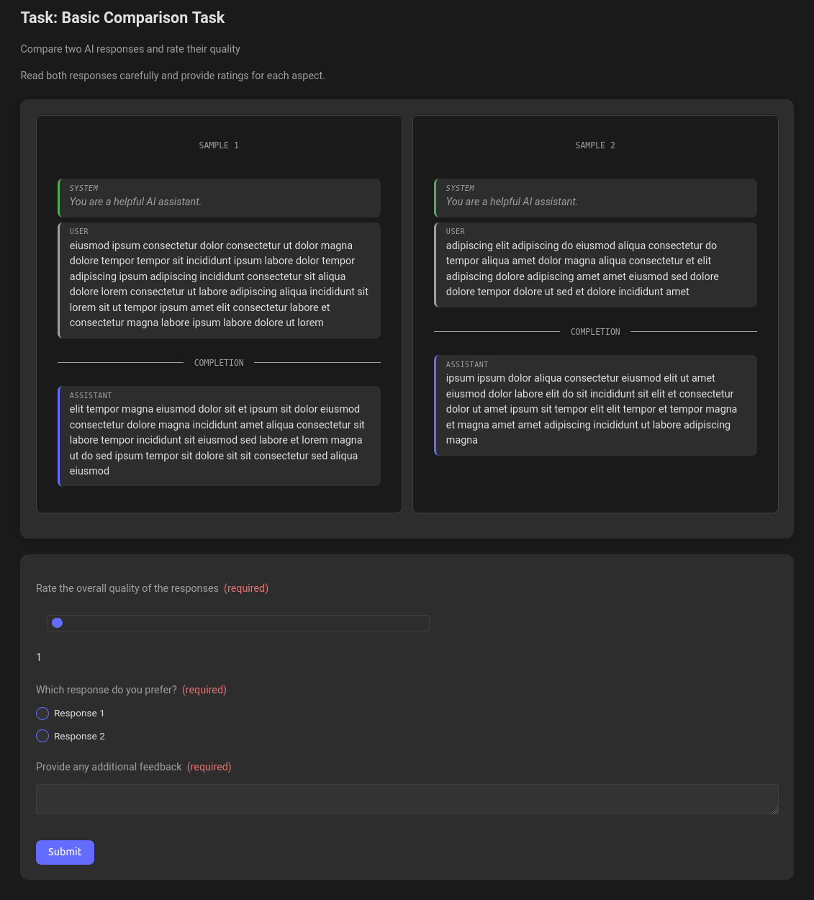

# Quest Data Labeler

An open-source data labeling platform.

## Development

Start the backend development server:
```bash
cd backend
npm install
npm run dev
```

Start the frontend development server:
```bash
cd frontend
npm install
npm run dev
```

## Deployment

Build the backend and start the production server:
```bash
cd backend
npm run build
npm run start
```

Build the frontend and start the production server:
```bash
cd frontend
npm run build
npm run start
```

**Deployment note**: The frontend expects to find the backend API at /api/. Configure your reverse proxy to route requests from endpoints beginning with /api to the backend server.

## Adding data

Data used and generated by this application is stored in the `data` directory. You can change the location of this directory by setting the `DATA_DIR` environment variable.

### Creating a new task

Tasks are specified with a JSON file that describes the task, the presentation format, and the feedback options. Here is an example task specification:

```json
{
  "taskInfo": {
    "name": "Basic Comparison Task",
    "description": "Compare two AI responses and rate their quality",
    "instructions": "Read both responses carefully and provide ratings for each aspect."
  },
  "dataset": "comparison_test.jsonl",
  "results": "comparison_results.jsonl",
  "presentation": {
    "type": "comparison",
    "displayType": "side_by_side"
  },
  "feedback": {
    "overall_quality": {
      "type": "numeric",
      "label": "Overall Quality",
      "description": "Rate the overall quality of the responses",
      "min": 1,
      "max": 5
    },
    "preferred_response": {
      "type": "select",
      "label": "Preferred Response",
      "description": "Which response do you prefer?",
      "options": [
        {
          "label": "Response 1",
          "value": "1"
        },
        {
          "label": "Response 2",
          "value": "2"
        }
      ]
    },
    "comments": {
      "type": "text",
      "label": "Additional Comments",
      "description": "Provide any additional feedback"
    }
  }
}
```

For a more complete specification, see [the docs](docs/task_format.md).

### Structuring the dataset

A dataset is a JSONL file that contains the data to be labeled.

Each line in the file is a JSON array containing a set of samples to be compared. All lines are expected to have the same number of samples, and to be of the same type.

Each sample is a JSON object that contains the following fields:

- `type`: The type of sample.
- `id`: The ID of the sample.
- `timestamp`: The timestamp of the sample.

Depending on the sample type, it may contain other fields. For example, a text completion sample contains a `prompt` and a `completion`, while a simple text sample only contains a `text` field. See [the docs](docs/dataset_format.md) for more information.

### Gathering data

The above two steps will result in a task specification and a dataset viewable on the frontend. It should look something like this:


